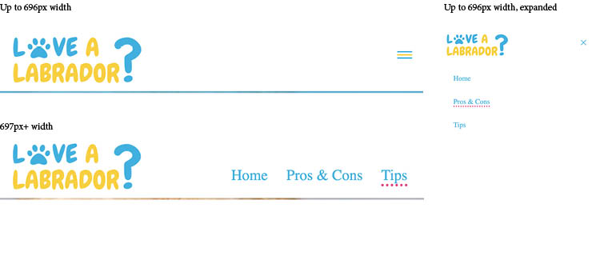
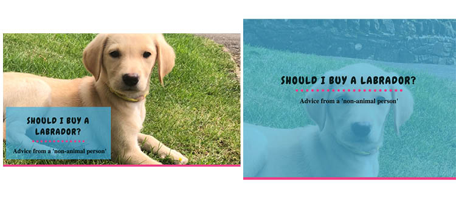
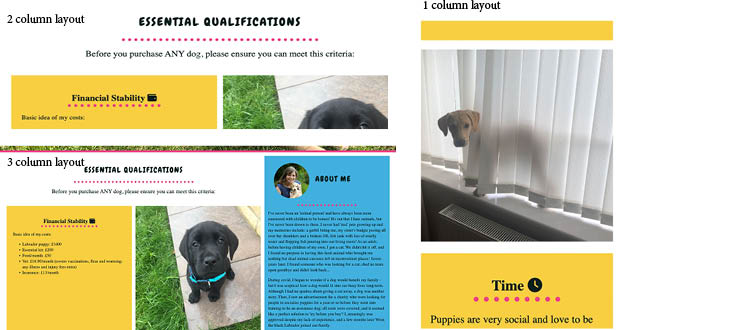
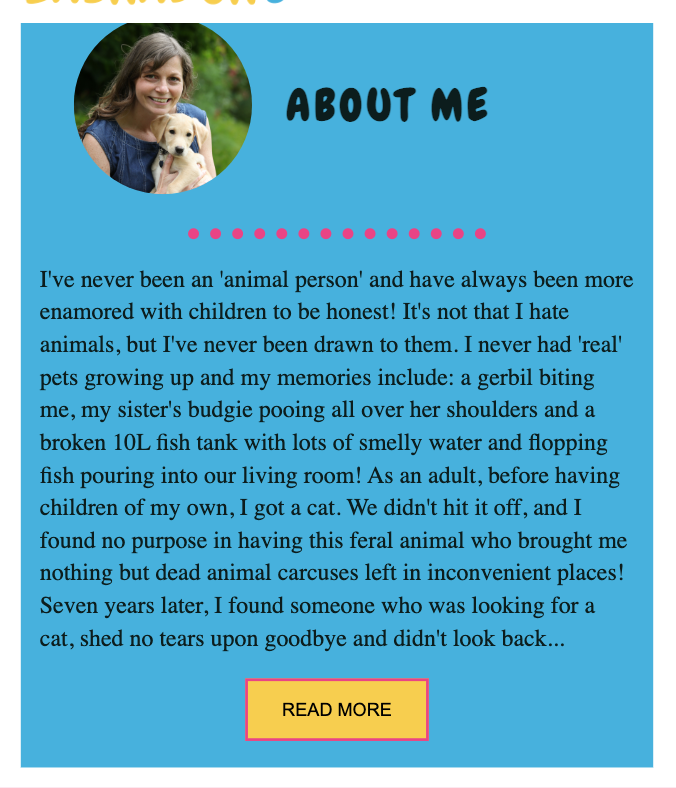
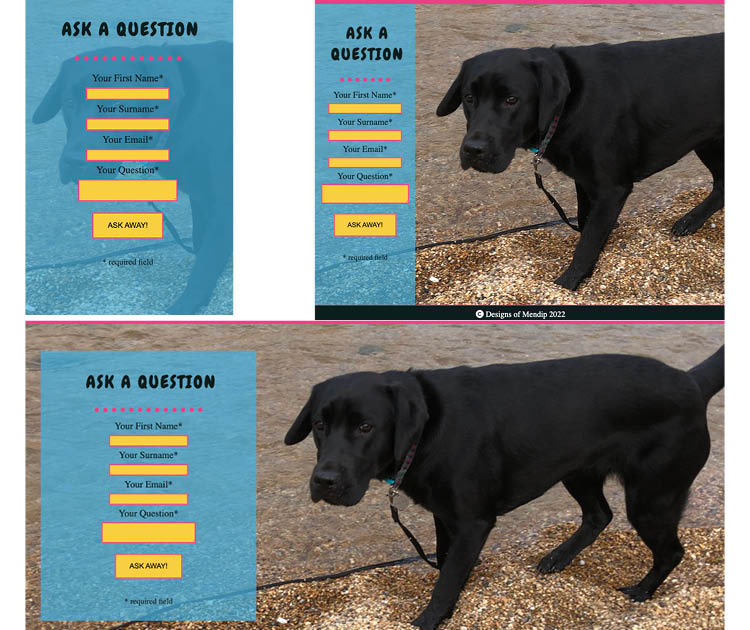
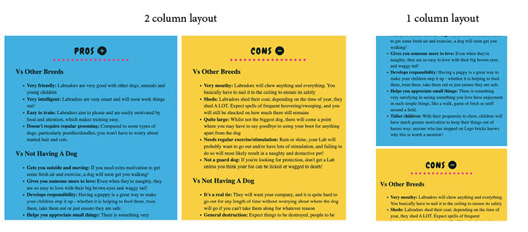

# Love a Labrador?

## Overview of website
This site is aimed at anyone who is unsure whether a Labrador Retriever is right for them.  According to <a href="https://www.devonlive.com/whats-on/family-kids/labrador-uks-most-popular-dog-6842152" target="_blank" rel="external">DevonLive</a> “The Labrador retriever has been the UK’s favourite pedigree dog breed for years, and there was a 54% increase in their numbers from 2020 to 2021.”  . There is a danger in equating popularity with suitability, and just because they are renowned as good family dogs doesn’t mean they aren’t hard work and a big commitment. According to <a href="https://www.bbc.co.uk/news/uk-58518892" target="_blank" rel="external">BBC News</a>, in September 2021, “The Dogs Trust said it expected to see an increase in the number of dogs it receives in the months to come, describing it as a "looming crisis". 

This ‘Love a Labrador?’ website helps potential owners assess whether or not they should go ahead by letting them know: the essential qualifications they need, the pros and cons of having a Labrador vs other breeds (or not having a dog at all) and tips on how to be a successful Labrador owner with a warning of what happens if you don’t put in the time to train a Labrador properly.

My aim is to have fewer Labradors:
<ul>
<li>being rehomed </li>
<li>not have the training they need to live up to their potential.</li>
</ul>

## Features

 

### Existing Features

 

<strong>Favicon:</strong> The blue pawprint is lifted from the logo – it is designed to be clear and easily recognisable in a browser bar if people move to another page as well as provide site continuity.

<strong>Logo:</strong> The logo adds continuity through the site as its appearance matches the heading fonts and colours used throughout the website. The pawprint in the logo matches the favicon. (The logo can be seen in the menu screenshot below.)

<strong>Menu:</strong> The full responsive menu guides people easily through the three pages of the site: Home, Pros & Cons and Tips. For mobiles, the menu becomes the widely recognised ‘hamburger menu” matching the colour scheme of the site. It’s fixed to the top of the page so that it is easily accessible wherever people are at on the site.

 

<strong>Hero Headers:</strong> These are designed to engage the viewer when they first come onto each page with animation, a cute photo of a puppy and a clear indication of the information found on the page. The mobile version has an opacity covering the entire image as the content took up a large proportion of the image.

 

<strong>Essential Qualifications:</strong> These provide the bare minimum requirements for any responsible dog owner so that is why they are given such prominence on the website. They are broken down into three bite-size chunks to make them easier to read.

 

<strong>About Me:</strong>This section is meant to help people identify with the website author and know that they are not alone as well as give them confidence that if they are willing to commit to doing it properly, Labradors are a great option – even for people who aren’t naturally drawn to animals. As it looks long on the mobile version and isn’t essential, there is a “Read More” option for smaller viewports. As this is not key information, it is given a semantic tag of an aside.

 

<strong>Ask a question:</strong> This is a friendly looking form with an inviting ‘Ask Away’ submit button to encourage people to get in touch if they are unsure of anything and want some advice. 

 

<strong>Pros and Cons:</strong> This is to help people assess the Pros and Cons of having a Labrador versus having other breeds (or no dog at all). I knew someone who purchased a Labrador to help her feel safe and be a ‘guard dog’ of sorts: this is completely the wrote type of dog for that! She ultimately gave her Labrador to a friend; it is happy and well cared for, but it is this type of misconception that this site hopes to address.  This section is placed second because it is assuming that people meet the ‘Essential Qualifications’ for having a dog and are now determining if this breed (or any dog) is really right for them.

 

<strong>Tips:</strong> This section came last as it is assuming that people have ultimately come to the conclusion that Labradors are potentially right for them. However, the site also wants to address that to be a responsible dog owner requires training (so that they won’t decide to give up the dog later due to behaviour issues): early and consistent training is key to having a happy, healthy and successful dog! The tips are broken down into small sections in coloured boxes with columns broken up by images to make them appealing and easy to read. Links to reputable sites provide additional research opportunities, and audio and video options provide the viewer to experience content with media, rather than just by reading.

 

### Features left to implement

<strong>Blog/Message Board:</strong> In the future, I would add a page with a blog where I could write updates and post photos about my training journey with my Labrador puppy Daisy and allow others to submit their stories/photos for inclusion. 

## Testing

### Layout:

I originally designed the homepage using the theories taught in the course (using floats, display: none, column widths/heights). With a rather complicated design of double column intro and an aside, it was very difficult to look good without an unmanageable number of breakpoints; to have my content and photos line up, I had to give each div an arbitrary size, which meant that, depending on media widths, I would have had massive gaps between my columns. Also, I was having to have extra filler images appear or be hidden depending on how my content was split so there wasn’t a massive gap in a column. I also would have to check the height for various breakpoints to make sure the columns were the same size. Finally, as my aside appeared in the wrong place in the mobile view (under the qualifications intro), I then had to hide/show the original/duplicate depending on the media width. It was all very messy and complicated, and I knew there had to be a better way...

Upon recommendation from my Mentor, I tried flex-box for my pros/cons page. Researching that also let me to grid css, which I implemented on my tips page. Both were remarkably easier to use, and my gaps between both pages were consistent and the pages looked much more professional. Upon reflection, I decided to redo my homepage with grid to ensure consistency in gaps/margins through the site. Unfortunately, doing it retrospectively caused a lot more effort and took a lot of experimentation to get it right, removing the extra divs, images and formatting that were no longer required.

### Hamburger menu:

I discovered that this would not work properly if the user had already scrolled down the page. Working with my mentor, we discovered the heading needed to be fixed as opposed to sticky.

### Media queries:

To make the site responsive, I went from three to two columns on both the home and Tips pages for a smaller screen/tablet, and then down again to a one column layout for mobile. For the pros/cons page, it went from a two column to a one column layout for mobile. I also had to add alternate mobile images for some background images to ensure that the dog’s face was shown.

### Consistency:

As I reviewed the site, I realised that there was a bit of inconsistency in various elements across the site, which I sought to address by changing the inconsistent elements to be stylised by classes which I then implemented throughout the site, removing only elements that had to change (e.g., the background image on the hero) to be used in specific ids/classes. I used this approach for the headings, buttons, top hero area and form areas (and as I mentioned earlier, redoing the homepage to ensure consistency with row and column gaps/margins).

### Colour contrast:

When initially selecting colours, I utilised WebAIM's colour contrast checker  to ensure the background colours I used were suitable for dark colour text at a normal size. I then found the lightest black shade I could that still met AAA standards for normal text to use as my main font colour. I put the blue/yellow combination into a colour wheel to find a complementary third colour: a shade of magenta pink. As it did not meet colour contrast standards for text, I used it solely for decoration.

### Validator Testing
<ul>
<li>HTML: No errors were returned when passing through the official W3C validator</li>
<li>CSS: No errors were found when passing through the official (Jigsaw) validator</li>
</ul>

### Unfixed Bugs

<strong>Form: </strong>The form submissions are currently set up to go to a form dump area on the Code Institute website. Ideally, these would be sent to my email so that I could respond accordingly, have reCAPTCHA functionality to weed out spam and an auto response/message so that the user knows that the form was successfully submitted. They were not fixed as I do not have a database capable of collecting data at the moment.

### What I Would Have Done Differently

<strong>Git Add/Commit: </strong>I sometimes found myself lost on a mission and would realise that I should have done an add/commit sooner than I did, and then tried to remember what it was I had done! I also sometimes thought I’d committed something and realised a typo of some sort meant it didn’t go through, and I’d often have to kill of a terminal and restart and then have a commit taking both messages into account. Unfortunately, this is not something that can be fixed retrospectively, but it is something I am going to be more mindful of in future.

## Deployment
<ul><li>The site was deployed to GitHub pages. The steps to deploy are as follows:<ol>
<li>In the GitHub repository, navigate to the Settings tab</li>
<li>From the source section drop-down menu, select the Master Branch</li>
<li>Once the master branch has been selected, the page will be automatically refreshed with a detailed ribbon display to indicate the successful deployment.</li></ol></li>
<li>The live link can be found here - https://mandyhole.github.io/love-a-lab/</li>
</ul>

## Credits:

### Content

The content for this website drew on my personal experience of owning a Labrador Retriever and my training from trainers through the charity Dogs for Good. However, I included several external links to reputable sources for more information that I think every potential owner should know, including:

<ul>
<li><a href="https://www.pdsa.org.uk/pet-help-and-advice/looking-after-your-pet/puppies-dogs/could-you-spot-a-puppy-farm" target="_blank" rel="external" aria-label="PDSA Spot a Puppy Farm advice">PDSA</a></li>
<li><a href="https://www.thekennelclub.org.uk/health-and-dog-care/health/health-and-care/a-z-of-health-and-care-issues" target="_blank" aria-label=" The Kennel Club Health and Care Issues" rel="external">The Kennel Club</a></li>
<li><a href="https://www.dogstrust.org.uk/help-advice/factsheets-downloads/basicdogtrainingfactsheetnov13.pdf" target="_blank" rel="external" aria-label="The Dogs Trust training tips">The Dogs Trust</a></li>
</ul>

iframe code for <em>Marley and Me</em> Trailer: <a href="https://www.youtube.com/watch?v=0UMMGNxg1Lg" target="_blank" rel="external" aria-label="Marley and Me Trailer on YouTube">YouTube</a>

### Code

Hamburger style menu: <a href="https://blog.logrocket.com/create-responsive-mobile-menu-with-css-no-javascript/" target="_blank" rel="external" aria-label="Log Rocket's Hamburger Style Code">Log Rocket</a>

Read More/ Read Less Button (used in Homepage About Me aside in mobile view): <a href="https://www.w3schools.com/howto/howto_js_read_more.asp" target="_blank" rel="external" aria-label="W3Schools Read More/ Read Less Code">W3Schools</a>

Flexbox: 
<ul>
<li><a href="https://www.youtube.com/watch?v=Y8zMYaD1bz0&list=PL4cUxeGkcC9i3FXJSUfmsNOx8E7u6UuhG" target="_blank" rel="external" aria-label="YouTube Tutorial on Flexbox">YouTube</a></li>
<li><a href="https://www.w3schools.com/css/css3_flexbox.asp" target="_blank" rel="external" aria-label="W3Schools advice on flexbox">W3Schools</a></li>
<li><a href="https://css-tricks.com/snippets/css/a-guide-to-flexbox/" target="_blank" rel="external" aria-label="CSS Tricks guide to Flexbox">CSS Tricks</a></li>
</ul>

CSS Grids: 

General concept for using Grids: <a href="https://www.w3schools.com/cssref/pr_grid.asp" target="_blank" rel="external">W3Schools</a>

Code for creating equal-width columns in CSS grid: <a href="https://css-tricks.com/equal-width-columns-in-css-grid-are-kinda-weird/" target="_blank" rel="external">CSS Tricks</a>

Hero Animation (Page Headers): Code Institute Love Running source code

### Media

Images on Tips page: <a href="https://www.pexels.com/" target="_blank" rel="external" aria-label="Pexels Image Library">Pexels</a>

Platform to create an ogg version of my mp4 file: <a href="https://convertio.co/" target="_blank" rel="external" aria-label="Convertio media converter">Convertio</a>

Chewy and Merriweather fonts used throughout the site: <a href="https://fonts.google.com" target="_blank" rel="external" aria-label="Google Fonts library">Google Fonts</a>

Icons used for my favicon, logo, homepage boxes and Pros/Cons boxes: <a href="https://fontawesome.com" target="_blank" rel="external" aria-label="Font Awesome icon library">Font Awesome</a>

Platform for creating a Favicon image: <a href="https://realfavicongenerator.net/" target="_blank" rel="external" aria-label="Favicon Generator website">Favicon Generator</a>

Platform for resizing images: Adobe PhotoShop

Platform for creating logo: Adobe Illustrator

Application to create audio version only of my movie of a dog making snuffling sounds: Quicktime
